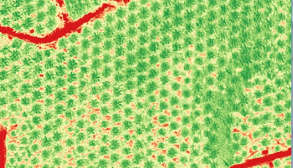
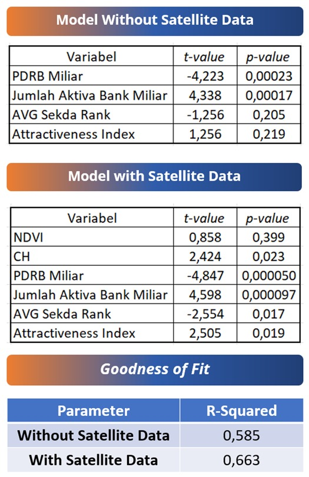
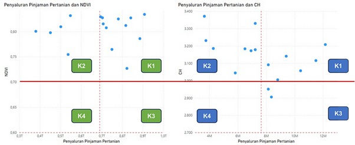

# Revolutionizing Business Intelligence in Banking with Remote Sensing: A Case Study on Agricultural MSME Credit Distribution in Rokan Hulu, Riau

> "Remote sensing is revolutionizing how we monitor Earth’s health, from climate change to food security and disaster response." — **Dr. Jane Lubchenco**

## 🌍 **Introduction: The Future of Banking Meets Remote Sensing**
In modern banking, data-driven decision-making is vital for achieving financial inclusion, managing risks, and distributing credit effectively. Traditional banking models rely heavily on historical financial data and credit scores, which often fail to capture the unique challenges in financing agricultural MSMEs (Micro, Small, and Medium Enterprises).

Enter **Remote Sensing and Satellite Data**—transformational technologies enhancing **Business Intelligence (BI)** in banking. These technologies allow banks to access real-time data, going beyond conventional methods and providing critical insights into agricultural financing.

### 💡 **Key Questions**:
- What if banks could leverage **real-time satellite data** to predict agricultural creditworthiness?
- How can **non-traditional financial data**, like geospatial and environmental insights, improve **MSME financing** in rural areas?

---

## 🚀 **Why Remote Sensing in Banking? A Data-Driven Approach**
### **Challenges in Traditional Agricultural Lending**:
- **Limited Financial History**: Small-scale farmers lack formal credit records, making them invisible to traditional credit scoring methods.
- **Unpredictable Weather & Crop Yields**: Weather and environmental factors influence repayment capacity, which is often not factored in conventional loan models.
- **Manual Credit Assessments**: Ground-based loan verification processes are slow, expensive, and unreliable in regions with limited infrastructure.

### **How Remote Sensing is Changing the Game**:
By integrating **satellite imagery**, **geospatial intelligence**, and **AI-driven analytics**, banks can now:
- **Monitor land productivity** in real-time using **NDVI (Normalized Difference Vegetation Index)**.
- **Assess climate risks** and **drought patterns** for better lending decisions.
- **Predict default probabilities** based on environmental factors and satellite data.
- **Enhance financial inclusion** by providing loans to previously unbanked rural farmers.

---

## 🔍 **Case Study 1: Modeling with Satellite Data to Improve MSME Palm Oil Credit Distribution in Rokan Hulu, Riau**
This case study demonstrates the significant impact of satellite data in improving credit distribution models for agricultural MSMEs.

### **Comparison of Models**:
- **Without Satellite Data**: The model explains 58.5% of credit variations, leaving 41.5% unexplained.
- **With Satellite Data**: The model accuracy improves to 66.3%, reducing unexplained variations to just 33.7%.

This improvement showcases the value of integrating satellite data in refining risk models and improving the predictive power of financial systems.

---

## 📊 **Case Study 2: Village Sustainability Potential Index (VSPI)**
**VSPI** uses **NDVI** and **Rainfall Data** to assess credit distribution, risks, and potential at the village level. The combination of these indicators allows banks to classify rural areas based on both agricultural potential and financial risk.

### **VSPI Quadrant Analysis**:
- **K1 (High NDVI, High Credit Disbursement)**: Highly productive agricultural areas with strong credit performance.
- **K2 (Low NDVI, High Credit Disbursement)**: Credit is distributed despite weak vegetation.
- **K3 (High NDVI, Low Credit Disbursement)**: Areas with high agricultural potential but underfunded.
- **K4 (Low NDVI, Low Credit Disbursement)**: High-risk, underdeveloped areas in need of intervention.

This model provides banks with powerful tools to prioritize high-risk, underfunded areas while targeting sustainable agricultural practices.

---

## 🌍 **What If Every Village Had Real-Time Environmental Insights?**
Imagine a future where every village in Indonesia can access:
- **Real-time environmental data**: Tracking land productivity, deforestation, and climate shifts.
- **Predictive credit scoring**: Using satellite imagery and AI models to evaluate loan eligibility.
- **Early warning systems for climate risks**: Informing farmers and businesses about potential disasters.
- **Sustainable financial inclusion**: Offering climate-smart banking solutions to unbanked rural communities.

---

## 💡 **Conclusion: The Future of Banking is Data-Driven**
The integration of **remote sensing** with **Business Intelligence** will shape the future of banking. It enables smarter, more inclusive lending decisions that benefit both financial institutions and rural economies.

### Key Benefits:
- Enhanced **predictive credit risk models** using multi-temporal satellite data.
- **Dynamic loan pricing models** based on **real-time climate risk scores**.
- **Stronger ESG compliance** for green banking initiatives.

The role of **AI**, **machine learning**, and **GIS** in banking will continue to grow, strengthening financial inclusion and sustainability.

---

### **Authors**:
- **Satrio Mangkunegoro** (Data Analyst)
- **Pandu Tri Praptomo** (Data Engineer)
